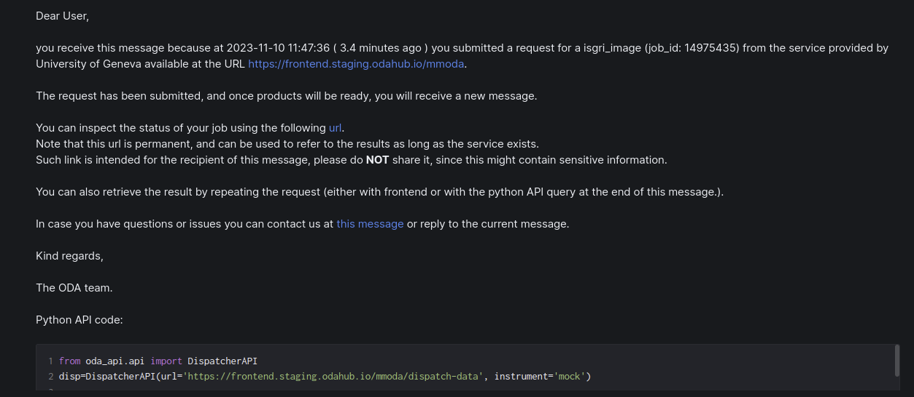

ODA Dispatcher
==========================================

A flexible python framework to bridge front-end and data-server for scientific online analysis of astrophysical data:

* provides boilerplate code to implement interfaces to specific instrument backends with [plugins](dispatcher-plugins).
* implements interface to [frontend](frontend).
* explains [auth](interfaces.md)

**this repository also contains much of relevant documentations to gluing these levels together**

What's the license?
-------------------

dispatcher-app is distributed under the terms of [The MIT License](LICENSE).

Who's responsible?
-------------------
Andrea Tramacere, Volodymyr Savchenko

Astronomy Department of the University of Geneva, Chemin d'Ecogia 16, CH-1290 Versoix, Switzerland

Jobs updates with messages on matrix
-----------------------------------------------

It is possible to receive update messages regarding the status of the jobs submitted on the mmoda platform. An emailing system is already provided out-of-the-box, provided that a token is used (this contains the user email address to which the updates will be sent, along with a number of other configurations, more details can be found [here](interfaces.md#user-tokens)).

The platform now supports also the sending of messages via the [Matrix](https://matrix.org/) platform, and a dedicated messaging bot (__@mmoda-bot__) is available for receiving jobs updates.

All communication over Matrix happens within a **room**: for this reason, in order to receive jobs updates, one must be configured.

Two options are possible:

* _**shared room**_: a room where multiple users can participate.  
* _**direct message room**_: a room where the messages are directly sent and received, to and from a particular user.

Obviously, an account on the matrix platform is necessary. In addition, a number of configuration steps are necessary, either on the token as well as on the matrix user account.

For the purpose of this documentation, the matrix client **element** will be used (https://element.io/).

Matrix account configuration
----------------------------

### Configuration of a shared room

Within the element client:
* Create a dedicated room 
 

 

* Invite the __@mmoda-bot__ user to the room created in the previous step

 

* __@mmoda-bot__ will then have to join the room (as stated within the [client-server-api](https://spec.matrix.org/latest/client-server-api/#room-membership)), and this will be automatically performed by the dispatcher.

Once a job is started, and the previous steps have been followed, the __@mmoda-bot__ will send updates regarding the state of the job.

An example of a message can be seen the image below:

### Token specific configuration

Within the token, some configuration are user-specific (and mandatory), whereas others are optional, and if not provided, a set of default values will be available within the dispatcher configuration:

* `mxroomid` (user-specific): id of the room to where the messages should be sent (can be a room for direct messages, or a room used specifically for the purpose of mmoda messages). Using the element client, this can be found within the settings of the room itself, as visualized within the image below:

For more detailed information regarding the other options, a dedicated section is available [here](interfaces.md#user-tokens).   

